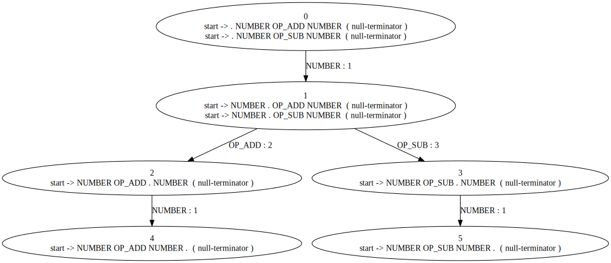

# fox-cc
My implementation of a compiler compiler with YACC-like grammar. 

Features:
* Custom linear-time regex engine
* Built-in regex-based lexer
* YACC-like grammar syntax
* LALR1 parser generator
* Output in DOT format

This project has been discontinued. 

# Requirements
* C++23 or higher
* MSVC >= 10.0.22621.0
* CMAKE

# [Example](https://github.com/RedSkittleFox/fox-yacc/blob/main/fox-cc-demo/main.cpp)
```cpp
#include <iostream>
#include <fstream>
#include <string>

#include <fox_cc.hpp>

int main()
{
	std::string grammar = R"(
%token	NUMBER		[0-9]+
%token	OP_ADD		[+]
%token	OP_SUB		[\-]
%token	OP_MUL		[*]
%token	OP_DIV		[/]
%token	OP_MOD		[%]
%token	L_PARENT	[(]
%token	R_PARENT	[)]

%start start

%%
start
	:	expression	{ forward }
	;

expression
	:	precedence_2 { forward }
	;

precedence_2
	:	precedence_2 OP_ADD precedence_1 { bin_op }
	|	precedence_2 OP_SUB precedence_1 { bin_op }
	|	precedence_1					 { forward }
	;

precedence_1
	:	precedence_1 OP_MUL precedence_0 { bin_op }
	|	precedence_1 OP_DIV precedence_0 { bin_op }
	|	precedence_1 OP_MOD precedence_0 { bin_op }
	|	precedence_0					 { forward }
	;

precedence_0
	:	NUMBER							{ forward }
	|	L_PARENT expression R_PARENT	{ parent_exp }
	;
%%
)";

	fox_cc::compiler cmp(grammar);

	cmp.register_action("forward", [](std::span<std::string> v)
	{
		return v[0];
	});
	cmp.register_action("bin_op", [](std::span<std::string> v)
	{
		auto lhs = std::stoi(v[0]);
		auto rhs = std::stoi(v[2]);
		int out;
		switch (v[1][0])
		{
		case '+':
			out = lhs + rhs; break;
		case '-':
			out = lhs - rhs; break;
		case '*':
			out = lhs * rhs; break;
		case '/':
			out = lhs / rhs; break;
		case '%':
			out = lhs % rhs; break;
		default:
			throw std::logic_error("Unknown operator.");
		}

		return std::to_string(out);
	});

	cmp.register_action("parent_exp", [](std::span<std::string> v) { return v[1]; });

	std::string op = "1+2*(2+2)";
  const auto computation_result = cmp.compile(op, f);
  std::cout << op << "=" << computation_result << '\n';
	
	return 0;
}
```

```
%token	NUMBER		[0-9]+
%token	OP_ADD		[+]
%token	OP_SUB		[\-]
%token	OP_MUL		[*]
%token	OP_DIV		[/]
%token	OP_MOD		[%]
%token	L_PARENT	[(]
%token	R_PARENT	[)]

%start start

%%
start
	:	NUMBER OP_ADD NUMBER { bin_op }
	;
%%
```



# TODO
* Enable manual RR and SR conflict resolution.
* Implement better error handling.
* Allow generic action callback signatures.
* Remove unused syntax.

# References
* *Modern Compiler Design* - Dick Grune
* *Compilers: Principles, Techniques, and Tools* - Ravi Sethi, Alfred Aho
* [*Regular Expression Matching Can Be Simple And Fast*](https://swtch.com/~rsc/regexp/regexp1.html)
* [*YACC's manual*](https://man7.org/linux/man-pages/man1/yacc.1p.html)
